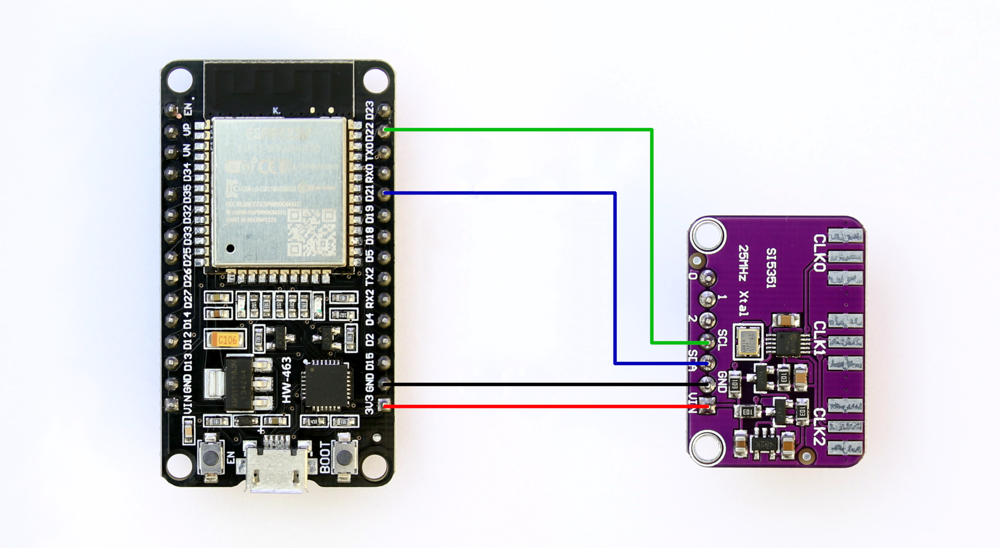

### Test circuit for use with the examples.

The circuit uses ESP32-WROOM-32D on NodeMCU-ESP32 and Si5351A clock generator breakout with 25MHz crystal.
The examples should work with other ESPs as well, but this may require changes to the I2C bus configuration (i2c_master.h).
Don't forget to copy the current Si5351 library to the example folder.

### Frequency plan.

